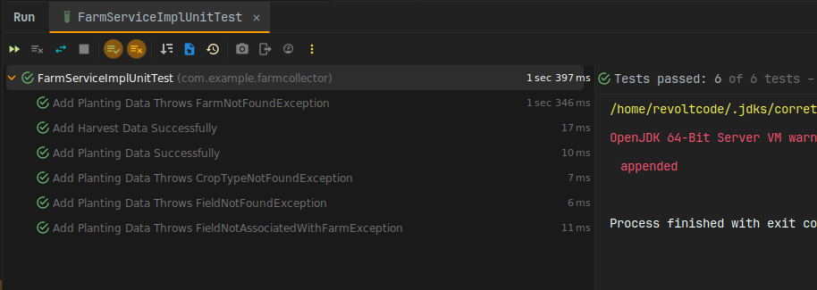
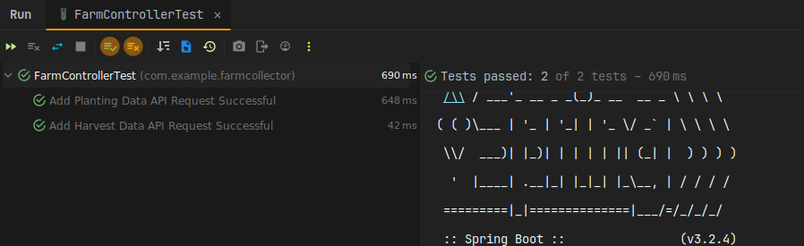

# Farm Collector

This Spring Boot application is designed to manage planting and harvesting activities for farms. It allows users to track planting, harvesting, and crop-related information for each field within a farm.

## Entities

### Farm
Represents an individual farm with its name and location.

### Field
Represents a field within a farm where planting and harvesting activities take place. Each field has a planting area and is associated with a specific farm.

### CropType
Represents different types of crops that can be planted.

### Season
Represents a season in which planting and harvesting occur. Each season has a name, start date, and end date.

### Planting
Represents the planting activity for a specific crop in a field during a season. Each planting record includes the associated field, season, crop type, and expected product amount.

### Harvest
Represents the harvested product data for a specific planting activity. Each harvest record includes the associated planting activity and the actual harvested amount.

## Design Considerations

- **Association with Planting**: Harvesting activities are associated with the specific planting activity from which the harvest originated. This ensures a clear link between the actual harvest and the planned planting, capturing information about the field, season, and crop type.
- **Granularity**: The design provides granularity by capturing planting and harvesting activities at the level of individual fields and specific seasons.
- **Flexibility**: By associating plantings with both a field and a specific season, the system accommodates complex planting scenarios such as multi-cropping and staggered planting within the same field.

## Technologies Used
- Java
- Spring Boot
- Spring Data JPA
- H2 Database (for demo purposes, can be replaced with other databases)

## Testing
- JUnit5
- Mockito

---
## Endpoints
### Add Planting Data
```
POST /api/farms/{farmId}/plantings
Request Body:
{
    "fieldId": 1,
    "seasonId": 1,
    "cropTypeId": 1,
    "expectedProductAmount": 100.0
}
```
Adds planting data for a specific field in a farm.

### Add Harvest Data
```
POST /api/farms/{farmId}/harvests
Request Body:
{
    "plantingId": 1,
    "actualHarvestedAmount": 80.0
}
```
Adds harvesting data for a specific planting.

### Generate Report
```
GET /api/reports/generate
```

---
## Farm Service Implementation
### Planting Implementation (addPlantingData)

- **Validation Checks**:
    - The service checks if the specified farm and field exist and if the field is associated with the farm.
    - It verifies the existence of the crop type and season.
    - It ensures that a crop can only be planted once on a field in any season.
- **Assumptions**:
    - It is assumed that each planting involves only one crop type and one field.
    - Each planting is associated with a specific season.

### Harvest Implementation (addHarvestData)

- **Validation Checks**:
    - The service checks if the specified planting exists and is associated with the specified farm.
- **Assumptions**:
    - It is assumed that each harvest is associated with a specific planting.
    - Each harvest represents the actual harvested amount for a planting.
    - A possible scenario which wasn't implemented is that a harvest cannot be more than the planted amount. This is only valid if the expected amount refers to the number planted.
      ```
        double actualHarvestedAmount = harvestRequest.actualHarvestedAmount();
        double expectedProductAmount = planting.getExpectedProductAmount();
        if (actualHarvestedAmount > expectedProductAmount) {
            throw new HarvestAmountExceedsPlantedAmountException("The harvested amount cannot exceed the planted " +
                    "amount/expected produce amount for planting with id " + plantingId);
        }
      ```

## Report Service Implementation

- **Calculation of Expected vs Actual Amounts**:
  - The report service calculates the expected and actual amounts of product for each farm, crop type, and season based on the provided planting and harvesting data.
- **Assumptions**:
  - It is assumed that each planting represents the expected amount of product for a specific crop in a field during a season.
  - Each harvest represents the actual amount of harvested product for a specific planting.
  - The report displays the expected vs actual amounts of product for each farm, crop type, and season.

---
## Tests Coverage
Unit tests are provided for the service layer and controller layer using JUnit 5 and Mockito. Tests cover various scenarios including success cases and error handling.
  - **FarmServiceImplUnitTest**
    

  - **FarmControllerUnitTest**
    

---

## Custom Exceptions

The application handles the following custom exceptions:
- `FarmNotFoundException`
- `FieldNotFoundException`
- `CropTypeNotFoundException`
- `SeasonNotFoundException`
- `FieldNotAssociatedWithFarmException`
- `CropAlreadyPlantedException`
- `PlantingNotFoundException`
- `PlantingNotAssociatedWithFarmException`
- `HarvestAmountExceedsPlantedAmountException`

## Controller Advice

A ControllerAdvice class (`CustomExceptionHandler`) is provided to handle custom exceptions and return appropriate error responses.

## Recommendations for Improvement

- **Security**: Implement authentication and authorization mechanisms to secure the endpoints.
- **Validation**: Enhance input validation to ensure data integrity and prevent invalid requests.
- **Logging**: Implement logging to track application events and errors for monitoring and troubleshooting.
- **Pagination**: Implement pagination for endpoints that return large datasets to improve performance.
- **Swagger Documentation**: Include Swagger documentation to provide a detailed description of the API endpoints.
- **Containerization**: Dockerize the application for easier deployment and scalability.
- **Integration Tests**: Add integration tests to verify the interactions between different layers of the application.
- **Exception Handling**: Refine exception handling to provide more informative error messages and handle edge cases more effectively.

---
